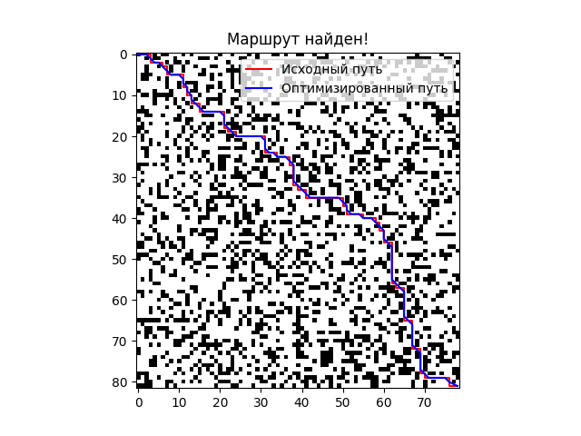

# Technical Details

## Table of Contents

1. [System Architecture Overview](#system-architecture-overview)
2. [Main Components](#main-components)
   - [Map Generation (`generate_map`)](#map-generation-generate_map)
   - [Heuristic Function (`heuristic`)](#heuristic-function-heuristic)
   - [Pathfinding (`find_path`)](#pathfinding-find_path)
   - [Path Optimization (`optimize_path`)](#path-optimization-optimize_path)
   - [Visualization](#visualization)
3. [Libraries Used](#libraries-used)
4. [Data Structure](#data-structure)

## System Architecture Overview

The navigation system of the autonomous robot consists of several interconnected components, each responsible for a specific part of the functionality:

1. **Map Generation**: Creating a two-dimensional environment with obstacles.
2. **Heuristic Function**: Estimating the distance between points for the pathfinding algorithm.
3. **Pathfinding**: Determining the optimal route from the starting point to the target point using the A\* algorithm.
4. **Path Optimization**: Improving the found path to reduce the number of turns and increase efficiency.
5. **Visualization**: Displaying the map, the found path, and the optimized route.

Each component is implemented as a separate function, which ensures modularity and simplifies code maintenance.

## Main Components

### Map Generation (`generate_map`)

**Description**:

The `generate_map` function is responsible for creating a two-dimensional matrix representing the space through which the robot will move. Each cell in the matrix can either be free (`0`) or contain an obstacle (`1`).

**Function Code**:

```Python
    def generate_map(height: int = None, width: int = None, wall_chance: float = 0.3) -> numpy.ndarray:
    """
    This function creates the field through which the robot moves.
    Note: The robot's starting position is always (0, 0), and its target coordinates are (height - 1, width - 1).

    :param height: int - The height of the field, if None - chosen randomly.
    :param width: int - The width of the field, if None - chosen randomly.
    :param wall_chance: float - The probability of a wall appearing in each cell of the field, if None - 0.3.
    :return: numpy.ndarray - The matrix representing the movement field. 0 - free cell, 1 - wall.
    """

    # Define height and width in case of random generation
    if height is None:
        height = numpy.random.randint(2, 100)
    if width is None:
        width = numpy.random.randint(2, 100)

    # Validate function parameters
    assert height > 1
    assert width > 1
    assert 1 >= wall_chance >= 0

    return numpy.random.choice(
        [0, 1],
        size=(height, width),
        p=[1 - wall_chance, wall_chance],
    )
```

**Key Aspects**:

- **Parameters**:

  - `height`: The height of the map. If not specified, a random value from 2 to 100 is chosen.
  - `width`: The width of the map. If not specified, a random value from 2 to 100 is chosen.
  - `wall_chance`: The probability of a wall appearing in each cell. If not specified, the default value (`0.3`) is used.

- **Map Generation**:

  - The `numpy.random.choice` function is used to randomly select values of 0 or 1 for each cell of the map.
  - The probabilities for selection are specified by `p=[1 - wall_chance, wall_chance]`, where `1 - wall_chance` is the probability of a free cell and `wall_chance` is the probability of an obstacle.

- **Setting Start and End Points**:

  - The robot's starting position is always `(0, 0)`.
  - The target position is `(height - 1, width - 1)`.

- **Return Value**:
  - A `numpy.ndarray` matrix representing the movement field.
  - `0` — free cell, `1` — obstacle (wall).

### Heuristic Function (`heuristic`)

**Description**:

The `heuristic` function is used to estimate the distance between two points on the map. It plays a key role in the A\* algorithm, determining the priority of nodes during processing.

**Function Code**:

```Python
    def heuristic(p1: tuple[int, int], p2: tuple[int, int]) -> int:
        """
        Function to estimate the distance between points p1 and p2.

        :param p1: tuple[int, int] - Coordinates of the first point.
        :param p2: tuple[int, int] - Coordinates of the second point.
        :return: int - Manhattan distance aka heuristic for points p1 and p2.
        """
        return abs(p1[0] - p2[0]) + abs(p1[1] - p2[1])
```

**Key Aspects**:

- **Parameters**:

  - `p1`: Coordinates of the first point.
  - `p2`: Coordinates of the second point.

- **Return Value**:

  - The Manhattan distance between points `p1` and `p2`. This is the sum of the absolute differences of their coordinates.

- **Usage**:
  - The heuristic function helps the A\* algorithm estimate how close the current node is to the goal and determine the order of node processing.

### Pathfinding (`find_path`)

**Description**:

The `find_path` function implements the A\* algorithm to find the optimal path from the start to the target point on the map. If no path is found, the function returns `None`.

**Function Code**:

```Python
    def find_path(
        robo_map: numpy.ndarray,
        start: tuple[int, int] = None,
        target: tuple[int, int] = None
) -> list[tuple[int, int]] | None:
    """
    This function calculates the path using the A* algorithm.
    If no path is found, returns None.

    :param robo_map: numpy.ndarray - The matrix representing the movement field. 0 - free cell, 1 - wall.
    :param start: tuple[int, int] - Coordinates of the starting point, if None - (0, 0).
    :param target: tuple[int, int] - Coordinates of the target point, if None - the last element of the robo_map matrix.
    :return: list[tuple[int, int]] - List of coordinates representing the found path.
    """
    # Define coordinates in case of random generation
    if start is None:
        start = (0, 0)
    if target is None:
        target = (robo_map.shape[0] - 1, robo_map.shape[1] - 1)

    # Validate function parameters
    assert robo_map.shape[0] > 1
    assert robo_map.shape[1] > 1
    assert 0 <= start[0] <= robo_map.shape[0] - 1
    assert 0 <= start[1] <= robo_map.shape[1] - 1
    assert 0 <= target[0] <= robo_map.shape[0] - 1
    assert 0 <= target[1] <= robo_map.shape[1] - 1
    if robo_map[target] == 1:
        return None

    # Define necessary variables for algorithm execution
    to_be_processed = []  # Heap of nodes waiting for processing
    came_from = {}  # Path to the current point being considered

    # Dictionary where the key is the point coordinates and the value is the length of the path to the point from the start
    g_len = {start: 0}

    # Dictionary where the key is the point coordinates and the value is the length of the path from the starting point to the target through this point
    f_len = {start: heuristic(start, target)}

    # Start processing by adding the starting point with the minimum priority in the queue
    heapq.heappush(to_be_processed, (0, start))
    while to_be_processed:
        current = heapq.heappop(to_be_processed)[1]  # Extract the point with the lowest priority

        # If the current element is the goal, simply reconstruct the route and return the desired path
        if current == target:
            found_path = []
            while current in came_from:
                found_path.append(current)
                current = came_from[current]
            found_path.append(start)
            return found_path[::-1]

        # Process neighboring coordinates
        for cell in [(0, 1), (1, 0), (0, -1), (-1, 0)]:
            neighbor = (current[0] + cell[0], current[1] + cell[1])

            # Check if we are out of map bounds
            if 0 <= neighbor[0] < robo_map.shape[0] and 0 <= neighbor[1] < robo_map.shape[1]:

                # Check if the cell is empty
                if robo_map[neighbor[0]][neighbor[1]] == 0:

                    tmp_g_len = g_len[current] + 1  # Calculate the temporary cost of the path to the current point

                    # If the neighbor point has not been visited
                    # or the temporary path of the current element is less than that of the neighboring point:
                    if neighbor not in g_len or tmp_g_len < g_len[neighbor]:
                        # Rewrite the point coordinates (or write new ones if the point did not exist)
                        came_from[neighbor] = current

                        # Update path length dictionaries with the current point data
                        g_len[neighbor] = tmp_g_len
                        f_len[neighbor] = heuristic(neighbor, target) + tmp_g_len

                        # Add the neighbor to the heap to be processed later according to its priority
                        heapq.heappush(to_be_processed, (f_len[neighbor], neighbor))
```

**Key Aspects**:

- **Parameters**:

  - `robo_map`: The map matrix, where `0` is a free cell, and `1` is an obstacle.
  - `start`: The robot's starting position. Default is `(0, 0)`.
  - `target`: The robot's target position. Default is `(height - 1, width - 1)`.

- **A\* Algorithm**:

  - A priority queue (`heapq`) is used to process nodes with the lowest expected path cost (`f_len`).
  - `g_len`: A dictionary that stores the path cost from the start to the current point.
  - `f_len`: A dictionary that stores the total path cost (`g_len + heuristic`).
  - `came_from`: A dictionary to reconstruct the path after reaching the goal.

- **Search Process**:

  1. Add the starting point to the processing queue.
  2. Iteratively extract the node with the lowest `f_len`.
  3. Check if the goal has been reached.
  4. Process neighboring nodes (up, down, left, right).
  5. Update `g_len` and `f_len` for neighboring nodes.
  6. Add neighboring nodes to the processing queue.

- **Return Value**:
  - A list of coordinates representing the found path from the start to the target point.
  - If no path is found, returns `None`.

### Path Optimization (`optimize_path`)

**Description**:

The `optimize_path` function is intended to improve the found route by reducing the number of robot turns and making movement smoother. The main idea is to add "shortcuts" at 45-degree angles whenever possible without colliding with obstacles.

**Function Code**:

```Python
    def optimize_path(defualt_path: list[tuple[int, int]]) -> list[tuple[int, int]] | None:
        """
        This function optimizes the robot's path.
        The main idea is to add "shortcuts" at 45 degrees to reduce the number of robot turns.

        :param defualt_path: list[tuple[int, int]] - The original list of route points.
        :return: list[tuple[int, int]] - The optimized list of route points.
        """
        # Validate the original path
        if defualt_path is None or len(defualt_path) < 3:
            return defualt_path

        # Declare an array for the new path
        optimal_path = []
        is_next_bad = False  # Flag indicating that the next element should be ignored

        # Traverse all path points and check for diagonals; if found, skip the intermediate element
        for i in range(len(defualt_path) - 2):
            if not is_next_bad:
                if defualt_path[i + 2][0] - defualt_path[i][0] == 1 and defualt_path[i + 2][1] - defualt_path[i][1] == 1:
                    optimal_path.append(defualt_path[i])
                    is_next_bad = True
                else:
                    optimal_path.append(defualt_path[i])
            else:
                is_next_bad = False

        # Remember the last element
        optimal_path.append(defualt_path[-1])

        return optimal_path
```

**Key Aspects**:

- **Parameters**:

  - `defualt_path`: The original list of route points found using the `find_path` function.

- **Optimization Process**:

  - The function checks consecutive points in the path to find opportunities to skip intermediate nodes and create a direct route.

- **Return Value**:
  - A list of optimized coordinates representing the found path from the start to the target point.

### Visualization

**Description**:
Visualization of the route and the map is performed using the `matplotlib` library. The map is displayed as a binary matrix, where black cells represent walls (`1`), and white cells represent free areas (`0`). The found and optimized paths are displayed using colored lines (red and blue, respectively).

**Libraries Used**:

- `matplotlib.pyplot` - for displaying the map and the route.
- `numpy` - for converting the path to an array that can be visualized using `matplotlib`.

**Key Aspects**:

- The original and optimized paths are displayed in different colors for easy analysis.
- If no path is found, a message indicating its inaccessibility is displayed.

**Usage Example**:



`success_path` - Example of successful pathfinding and optimization visualization.


`path_error` - Example of visualization when no path is found due to obstacles on the map.

### Libraries Used

```Python
import numpy
import heapq
import matplotlib.pyplot
```

- `numpy`: Used for creating and working with the map matrix, as well as for converting the path to an array for visualization.
- `heapq`: Implements a priority queue that helps the A\* algorithm efficiently choose nodes for processing.
- `matplotlib.pyplot`: Used for visualizing the map and routes.

### Data Structure

- Two-dimensional matrix (`numpy.ndarray`): Represents the map, where `0` means a free cell, and `1` means a wall.
- Tuples (`tuple[int, int]`): Used to store point coordinates on the map.
- Dictionaries: Used to store information about path costs (`g_len`, `f_len`) and to track the path (`came_from`).
- List (`list[tuple[int, int]]`): Represents the found and optimized routes.

[Back to top](../../README.en.md)
