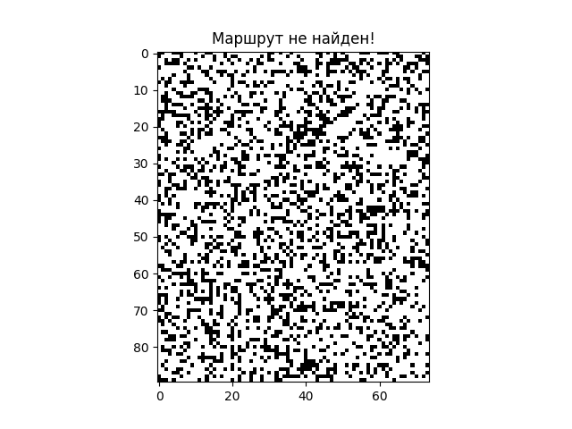

# Руководство пользователя

## Оглавление

1. [Запуск системы навигации](#Запуск-системы-навигации)
2. [Обработка ошибок](#Обработка-ошибок)
3. [Советы и рекомендации](#Советы-и-рекомендации)

## Запуск системы навигации

Для использования системы навигации выполните следующие действия:

1. **Генерация карты**: Используйте функцию `generate_map()` для создания поля. Вы можете задать высоту, ширину и вероятность появления стен, либо использовать значения по умолчанию.

Генерация карты с рандондомными значениями высоты и ширины (от 2 до 100 и вероятностью появления стен 30%):

```Python
mappy = generate_map()
```

Генерация карты с заданными размерами и вероятностью появления стен (в данном случае 100 строк, 100 столбцов и с вероятностью появления стен в 60%):

```Python
mappy = generate_map(100, 100, 0.6)
```

2. **Задание начальной и конечной точек**:
   При вызове функции `find_path()` задается начальная и конечная точки перемещения робота. Например, начальная точка `(0, 0)` и конечная точка `(9, 9)`:

   ```Python
   path = find_path(mappy, (0, 0), (9, 9))
   ```

Если начальная и конечная точки не заданы, по умолчанию используются `(0, 0)` и `(height - 1, width - 1)`:

```Python
path = find_path(mappy)
```

3. **Поиск пути**: С помощью функции `find_path()` вычисляется путь от начальной до конечной точки. Если путь найден, он будет представлен в виде списка координат. Если путь ненайден, функция вернет `None`.

4. **Интерпретация результата поиска пути**: Если функция `find_path()` возвращает список координат, это означает, что путь найден. Каждая координата в списке представляет собой точку, через которую проходит робот, начиная с начальной точки и заканчивая целевой. Если функция возвращает `None`, это означает, что путь недостижим из-за препятствий на карте.

**Пример интерпретации результата**:

5. **Оптимизация пути**: Опционально используйте `optimize_path()` для оптимизации найденного маршрута. Оптимизация уменьшает количество поворотов и делает маршрут более прямолинейным.

6. **Визуализация**: Используйте встроенную визуализацию, чтобы отобразить карту и найденный маршрут. В открывшемся окне на карте будут отображены исходный и оптимизированный пути, если они найдены. Если маршрут ненайден, то в открывшемся окне будет отображена только карта.

## Обработка ошибок

**Отсутствие пути**: Если функция `find_path()` возвращает `None`, это означает, что целевая точка недостижима из-за наличия препятствий. В этом случае попробуйте сгенерировать новую карту или уменьшить вероятность появления стен.

**Пример обработки ошибки отсутствия пути**:



**Неверные параметры**: Убедитесь, что параметры, передаваемые в функции, соответствуют требованиям (например, высота и ширина должны быть больше `1` и это должно быть целочисленное число, вероятность появления стены должна быть между `0` и `1` и это должно быть вещественное число). При неправильных параметрах будет вызвано исключение `AssertionError`. В этом случае попробуйте передать валидные значения в функицю и перезапустить программу.

**Пример обработки ошибки неверных параметров**:

```terminal
Traceback (most recent call last):
  File "c:\Users\path\to\direcory\rob-in-main\main.py", line 160, in <module>
    mappy = generate_map(-15, 7, 0.3)
            ^^^^^^^^^^^^^^^^^^^^^^^^^
  File "c:\Users\path\to\direcory\rob-in-main\main.py", line 24, in generate_map
    assert height > 1
           ^^^^^^^^^^
AssertionError
```

**Советы и рекомендации**:

- **Параметры карты**: Экспериментируйте с размерами карты и вероятностью появления стен для достижения оптимального баланса между сложностью и возможностью нахождения пути.
- **Обработка больших карт**: Для больших карт визуализация может замедляться. Рассмотрите возможность уменьшения размера изображения или использования более эффективных методов визуализации.
- **Повторяемость генерации**: Для воспроизводимости результатов можно установить фиксированный случайный seed с помощью `numpy.random.seed(seed_value)`.

[К началу](../../README.md)
