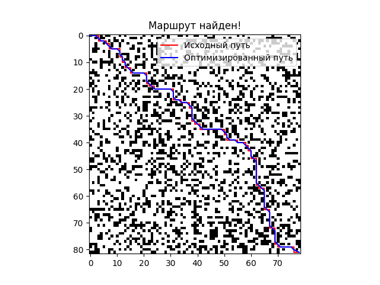
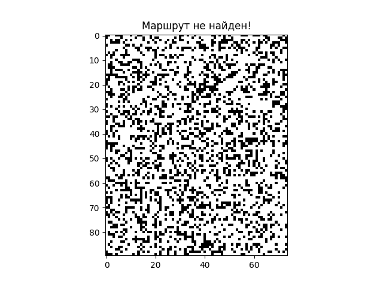

# Технические детали

## Содержание

1. [Обзор архитектуры системы](#Обзор-архитектуры-системы)
2. [Основные компоненты](#Основные-компоненты)
   - [Генерация карты (`generate_map`)](#Генерация-карты-generate_map)
   - [Эвристическая функция (`heuristic`)](#Эвристическая-функция-heuristic)
   - [Поиск пути (`find_path`)](#Поиск-пути-find_path)
   - [Оптимизация пути (`optimize_path`)](#Оптимизация-пути-optimize_path)
   - [Визуализация](#Визуализация)
3. [Используемые библиотеки](#Используемые-библиотеки)
4. [Структура данных](#Структура-данных)

## Обзор архитектуры системы

Система навигации автономного робота состоит из нескольких взаимосвязанных компонентов, каждый из которых отвечает за определённую часть функциональности:

1. **Генерация карты**: Создание двумерной среды с препятствиями.
2. **Эвристическая функция**: Оценка расстояния между точками для алгоритма поиска пути.
3. **Поиск пути**: Определение оптимального маршрута от начальной до конечной точки с использованием алгоритма A\*.
4. **Оптимизация пути**: Улучшение найденного маршрута для сокращения количества поворотов и повышения эффективности.
5. **Визуализация**: Отображение карты, найденного пути и оптимизированного маршрута.

Каждый компонент реализован в виде отдельной функции, что обеспечивает модульность и упрощает сопровождение кода.

## Основные компоненты

### Генерация карты (`generate_map`)

**Описание**:

Функция `generate_map` отвечает за создание двумерной матрицы, представляющей пространство, по которому будет перемещаться робот. Каждая ячейка матрицы может быть либо свободной (`0`), либо содержать препятствие (`1`).

**Код функиции**:

```Python
    def generate_map(height: int = None, width: int = None, wall_chance: float = 0.3) -> numpy.ndarray:
    """
    Функция создаёт поле, по которому перемещается робот.
    Важно: начальная позиция робота всегда равна (0, 0), а координаты его цели (height - 1, width - 1).

    :param height: int - "Высота" поля перемещения, если None - выбирается случайным образом.
    :param width: int - "Ширина" поля перемещения, если None - выбирается случайным образом.
    :param wall_chance: float - Вероятность появления стены для каждой ячейки поля перемещения, если None - 0.3.
    :return: numpy.ndarray - Матрица, представляющая собой поле перемещения. 0 - свободная ячейка, 1 - стена.
    """

    # Определение высоты и ширины, в случае случайной генерации
    if height is None:
        height = numpy.random.randint(2, 100)
    if width is None:
        width = numpy.random.randint(2, 100)

    # Валидация параметров функции
    assert height > 1
    assert width > 1
    assert 1 >= wall_chance >= 0

    return numpy.random.choice(
        [0, 1],
        size=(height, width),
        p=[1 - wall_chance, wall_chance],
    )
```

**Ключевые аспекты**:

- **Параметры**:

  - `height`: Высота карты. Если не указана, выбирается случайное значение от 2 до 100.
  - `width`: Ширина карты. Если не указана, выбирается случайное значение от 2 до 100.
  - `wall_chance` - Вероятность появления стены в каждой ячейке. Если не указана, берется значение по умолчанию (`0.3`).

- **Генерация карты**:

  - Используется функция `numpy.random.choice` для случайного выбора значений 0 или 1 для каждой ячейки карты.
  - Вероятности выбора задаются параметром `p=[1 - wall_chance, wall_chance]`, где `1 - wall_chance` — вероятность свободной ячейки, а `wall_chance` — вероятность препятствия

- **Установка начальной и конечной точек**:

  - Начальная позиция робота всегда `(0, 0)`
  - Целевая позиция — `(height - 1, width - 1)`.

- **Возвращаемое значение**:
  - Матрица `numpy.ndarray`, представляющая собой поле перемещения робота.
  - `0` — свободная ячейка, `1` — препятствие (стена).

### Эвристическая функция (`heuristic`)

**Описание**:

Функция heuristic используется для оценки расстояния между двумя точками на карте. Она играет ключевую роль в алгоритме A\*, определяя приоритет узлов при их обработке

**Код функции**:

```Python
    def heuristic(p1: tuple[int, int], p2: tuple[int, int]) -> int:
        """
        Функция для оценки расстояния между точками p1 и p2.

        :param p1: tuple[int, int] - Координаты первой точки.
        :param p2: tuple[int, int] - Координаты второй точки.
        :return: int - Манхэтэнское расстояния aka эвристика для точек p1 и p2.
        """
        return abs(p1[0] - p2[0]) + abs(p1[1] - p2[1])
```

**Ключевые аспекты**:

- **Параметры**:

  - `p1`: Координаты первой точки.
  - `p2`: Координаты второй точки.

- **Возвращаемое значение**:

  - Манхэттенское расстояние между точками `p1` и `p2`. Это сумма абсолютных разностей их координат.

- **Использование**:
  - Эвристическая функция помогает алгоритму A\* оценивать, насколько близко текущий узел к цели, и определять порядок обработки узлов.

### Поиск пути (`find_path`)

**Описание**:

Функция `find_path` реализует алгоритм A\* для поиска оптимального пути от начальной до конечной точки на карте. Если путь не найден, функция возвращает `None`.

**Код функции**:

```Python
    def find_path(
        robo_map: numpy.ndarray,
        start: tuple[int, int] = None,
        target: tuple[int, int] = None
) -> list[tuple[int, int]] | None:
    """
    Функция вычисляет путь, применяя алгоритм A*.
    Если путь не найден, возвращается None.

    :param robo_map: numpy.ndarray - Матрица, представляющая собой поле перемещения. 0 - свободная ячейка, 1 - стена.
    :param start: tuple[int, int] - Координаты первого участка пути, если None - (0, 0).
    :param target: tuple[int, int] - Координаты конечного участка пути, если None - последний элемент матрицы robo_map.
    :return: list[tuple[int, int]] - Список координат, принадлежащих найденному пути.
    """
    # Определение координат, в случае случайной генерации
    if start is None:
        start = (0, 0)
    if target is None:
        target = (robo_map.shape[0] - 1, robo_map.shape[1] - 1)

    # Валидация параметров функции
    assert robo_map.shape[0] > 1
    assert robo_map.shape[1] > 1
    assert 0 <= start[0] <= robo_map.shape[0] - 1
    assert 0 <= start[1] <= robo_map.shape[1] - 1
    assert 0 <= target[0] <= robo_map.shape[0] - 1
    assert 0 <= target[1] <= robo_map.shape[1] - 1
    if robo_map[target] == 1:
        return None

    # Определяем необходимые переменные для работы алгоритма
    to_be_processed = []  # Куча с узлами, ожидающими обработки
    came_from = {}  # Путь до текущей расссматриваемой точки

    # Словарь, где ключ - координаты точки, а значение - длина пути до точки от начала пути
    g_len = {start: 0}

    # Слоаврь, где ключ - координаты точки, а значение - длина пути от начала координат, до конца пути ЧЕРЕЗ эту точку
    f_len = {start: heuristic(start, target)}

    # Начинаем обработку, предварительно добавив начало пути, с минимальным приоритетом очереди
    heapq.heappush(to_be_processed, (0, start))
    while to_be_processed:
        current = heapq.heappop(to_be_processed)[1]  # Извлекаем точку с наименьшим приоритетом

        # Если текущий элемент - цель, тогда просто восстанавливаем маршрут и возвращаем искомый путь
        if current == target:
            found_path = []
            while current in came_from:
                found_path.append(current)
                current = came_from[current]
            found_path.append(start)
            return found_path[::-1]

        # Обрабатываем соседние координаты
        for cell in [(0, 1), (1, 0), (0, -1), (-1, 0)]:
            neighbor = (current[0] + cell[0], current[1] + cell[1])

            # Проверяем не вышли ли мы за границы карты
            if 0 <= neighbor[0] < robo_map.shape[0] and 0 <= neighbor[1] < robo_map.shape[1]:

                # Проверяем, является ли ячейка пустой
                if robo_map[neighbor[0]][neighbor[1]] == 0:

                    tmp_g_len = g_len[current] + 1  # Рассчитываем временную стоимость пути до текущей точки

                    # Самое интересное: Если соседняя точка не была посещена
                    # или временный путь текущего элемента меньше чем у соседней точки:
                    if neighbor not in g_len or tmp_g_len < g_len[neighbor]:
                        # Переписываем координаты точки (или же прост записываем новые, если точки не было)
                        came_from[neighbor] = current

                        # Обновляем словари длин путей данными текущей точки
                        g_len[neighbor] = tmp_g_len
                        f_len[neighbor] = heuristic(neighbor, target) + tmp_g_len

                        # Добавлеям соседа в кучу, что бы потом ео обработать, согласно его приоритету в ней
                        heapq.heappush(to_be_processed, (f_len[neighbor], neighbor))
```

**Ключевые аспекты**:

- **Параметры**:

  - `robo_map`: Матрица карты, где `0` — свободная ячейка, `1` — препятствие.
  - `start`: Начальная позиция робота. По умолчанию `(0, 0)`.
  - `target`: Целевая позиция робота. По умолчанию `(height - 1, width - 1)`.

- **Алгоритм A\***:

  - Используется очередь с приоритетом (`heapq`) для обработки узлов с наименьшей ожидаемой стоимостью пути (`f_len`).
  - `g_len`: Словарь, хранящий стоимость пути от начала до текущей точки.
  - `f_len`: Словарь, хранящий суммарную стоимость пути (`g_len + heuristic`).
  - `came_from`: Словарь для восстановления пути после достижения цели.

- **Процесс поиска**:

  1. Добавление начальной точки в очередь обработки.
  2. Итеративное извлечение узла с наименьшим `f_len`.
  3. Проверка достижения цели.
  4. Обработка соседних узлов (вверх, вниз, влево, вправо).
  5. Обновление `g_len` и `f_len` для соседних узлов.
  6. Добавление соседних узлов в очередь обработки.

- **Возвращаемое значение**:
  - Список координат, представляющих найденный путь от начальной до конечной точки.
  - Если путь не найден, возвращается `None`.

### Оптимизация пути (`optimize_path`)

**Описание**:

Функция `optimize_path` предназначена для улучшения найденного маршрута, сокращая количество поворотов робота и делая движение более плавным. Основная идея заключается в добавлении "срезок" под 45 градусов, когда это возможно, без столкновения с препятствиями.

**Код функции**:

```Python
    def optimize_path(defualt_path: list[tuple[int, int]]) -> list[tuple[int, int]] | None:
        """
        Функция оптимизирует путь робота.
        Основная идея заключается в добавлении "срезок" под 45 граусов, позволяя уменьшать количество поротов робота.

        :param defualt_path: list[tuple[int, int]] - Исходный список точек маршрута.
        :return: list[tuple[int, int]] - Оптимизированный список точек маршрута.
        """
        # Валидация исходного пути
        if defualt_path is None or len(defualt_path) < 3:
            return defualt_path

        # Объявляем массив для нового пути
        optimal_path = []
        is_next_bad = False  # Флаг, показывает что следующий элемент следует проигнорировать

        # В цикле просто обходим все точки пути и смотрим есть ли диагональ, если находим, пропускаем промежуточный элемент
        for i in range(len(defualt_path) - 2):
            if not is_next_bad:
                if defualt_path[i + 2][0] - defualt_path[i][0] == 1 and defualt_path[i + 2][1] - defualt_path[i][1] == 1:
                    optimal_path.append(defualt_path[i])
                    is_next_bad = True
                else:
                    optimal_path.append(defualt_path[i])
            else:
                is_next_bad = False

        # Не забываем про последний элемент
        optimal_path.append(defualt_path[-1])

        return optimal_path
```

**Ключевые аспекты**:

- **Параметры**:

  - `defualt_path`: Исходный список точек маршрута, найденного с помощью функции `find_path`.

- **Процесс оптимизации**:

  - Функция проверяет последовательные точки маршрута, чтобы найти возможность пропуска промежуточных узлов для создания прямого маршрута.

- **Возвращаемое значение**:
  - Список оптимизированных координат, представляющих найденный путь от начальной до конечной точки.

### Визуализация

**Описание**:
Визуализация маршрута и карты осуществляется с использованием библиотеки `matplotlib`. Карта отображается в виде бинарной матрицы, где черные клетки представляют стены (`1`), а белые — свободные участки (`0`). Найденный и оптимизированный маршруты отображаются с использованием цветных линий (красный и синий соответственно).

**Используемые библиотеки**: - `matplotlib.pyplot` - для отображения карты и маршрута. - `numpy` - для преобразования пути в массив, который можно отобразить с помощью `matplotlib`.

**Ключевые аспекты**: - Исходный и оптимизированный маршруты отображаются с использованием разных цветов для удобства анализа. - Если путь не найден, отображается сообщение о его недостижимости.

**Пример использования**:

`success_path` - Пример визуализации успешного поиска пути и его оптимизации.


`path_error` - Пример визуализации отсутствия пути из-за препятствий на карте.

### Используемые библиотеки

```Python
import numpy
import heapq
import matplotlib.pyplot
```

- `numpy`: Используется для создания и работы с матрицей карты, а также для преобразования пути в массив для визуализации.
- `heapq`: Реализует очередь с приоритетом, которая помогает алгоритму A\* эффективно выбирать узлы для обработки.
- `matplotlib.pyplot`: Используется для визуализации карты и маршрутов.

### Сруктура данных

- Двумерная матрица (`numpy.ndarray`): Представляет карту, где `0` означает свободную ячейку, а `1` — стену.
- Кортежи (`tuple[int, int]`): Используются для хранения координат точек на карте.
- Словари: Используются для хранения информации о стоимости путей (`g_len`, `f_len`) и для отслеживания пути (`came_from`).
- Список (`list[tuple[int, int]]`): Представляет найденный и оптимизированный маршруты.

[К началу](../../README.md)
